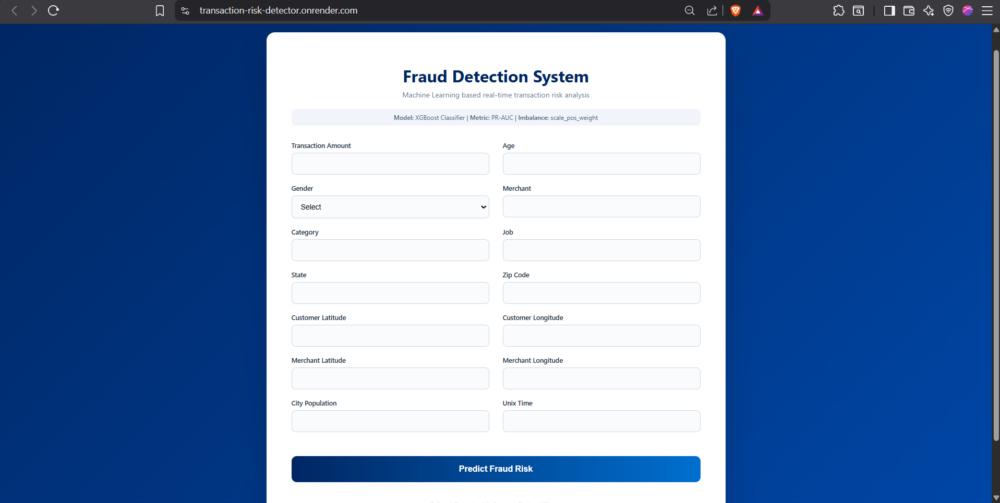
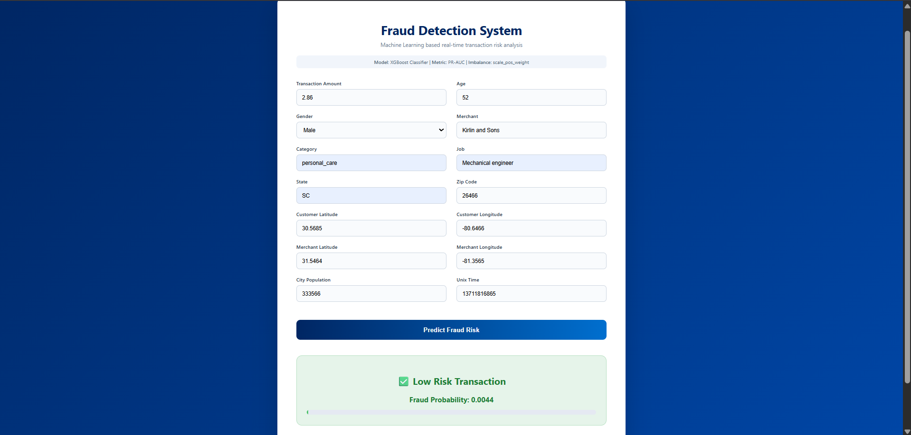

# 🚨 Transaction Risk Detector – Fraud Detection System

A **production-ready machine learning web application** for **real-time transaction fraud detection**, built using **XGBoost**, **Flask**, and **Docker**, and deployed on **Render**.

This system predicts the **fraud probability** of a transaction and classifies it as **Low Risk** or **High Risk**, handling highly imbalanced fraud data effectively.

---

## 🌐 Live Demo

🔗 **Live Application:**  
https://transaction-risk-detector.onrender.com  

> ⚠️ *Note:* Hosted on Render Free Tier — the service may spin down after inactivity and take ~30–50 seconds to wake up.

---

## 🖥️ Application Preview

### 🔹 Input Form (Transaction Details)


### 🔹 Prediction Result (Risk & Probability)


---

## 🧠 Machine Learning Model

- **Algorithm:** XGBoost Classifier (Gradient Boosted Decision Trees)
- **Problem Type:** Binary Classification (Fraud / Non-Fraud)
- **Imbalance Handling:** `scale_pos_weight`
- **Evaluation Metric:** PR-AUC (Precision–Recall AUC)
- **Output:**
  - Fraud Probability
  - Final Risk Classification (Low Risk / High Risk)

### 📌 Why PR-AUC?
Fraud datasets are highly imbalanced. PR-AUC focuses on **precision and recall of the minority (fraud) class**, making it more reliable than accuracy.

---

## ⚙️ Features

- ✅ Real-time transaction risk prediction  
- ✅ Probability-based fraud scoring  
- ✅ Handles severe class imbalance  
- ✅ Clean and responsive UI  
- ✅ End-to-end ML inference pipeline  
- ✅ Dockerized deployment  
- ✅ Auto-deploy from GitHub to Render  
- ✅ Production-style logging & exception handling  

---

## 🏗️ Tech Stack

### Backend
- Python
- Flask
- Pandas, NumPy
- XGBoost
- scikit-learn

### Frontend
- HTML5
- CSS3

### Deployment & DevOps
- Docker
- Render
- Git & GitHub

---

## 📂 Project Structure

```text
Transaction-Risk-Detector/
│
├── app.py                     # Flask application entry point
├── Dockerfile                 # Docker configuration for deployment
├── requirements.txt           # Python dependencies
│
├── artifacts/
│   └── model.pkl              # Trained ML model
│
├── src/
│   └── transaction/
│       ├── pipelines/
│       │   └── prediction_pipeline.py   # Inference pipeline
│       │
│       ├── logger/             # Custom logging module
│       └── exception/          # Custom exception handling
│
├── templates/
│   └── index.html              # Frontend HTML template
│
├── static/
│   └── css/
│       └── styles.css          # UI styling
│
├── README.md                   # Project documentation
```

## 🔁 ML Workflow

1. User enters transaction details via UI  
2. Data is converted into a Pandas DataFrame  
3. Preprocessing & encoding handled in pipeline  
4. XGBoost model predicts fraud probability  
5. Result displayed as:
   - **Low Risk** ✅ or **High Risk** 🚨  
   - Fraud Probability score  

---

## 🚀 Deployment

- Application is **containerized using Docker**
- Deployed on **Render Web Service**
- **Auto-deploy enabled** on every push to `main` branch
- Flask app exposed on Render-assigned port

---

## 🛡️ Disclaimer

This project is built for **educational and demonstration purposes** only.  
It should **not** be used as a standalone fraud prevention system in production financial environments without additional security, monitoring, and compliance layers.

---

## 🎤 Interview One-Liner

> “I built an end-to-end machine learning fraud detection system using XGBoost, handled class imbalance with scale_pos_weight, deployed it as a Dockerized Flask app on Render, and exposed a real-time prediction UI.”

---

## ⭐ Future Improvements

- Model explainability (SHAP)
- Confidence threshold tuning
- Authentication & rate limiting
- API versioning
- Database logging of transactions

# Transaction-Risk-Detector
